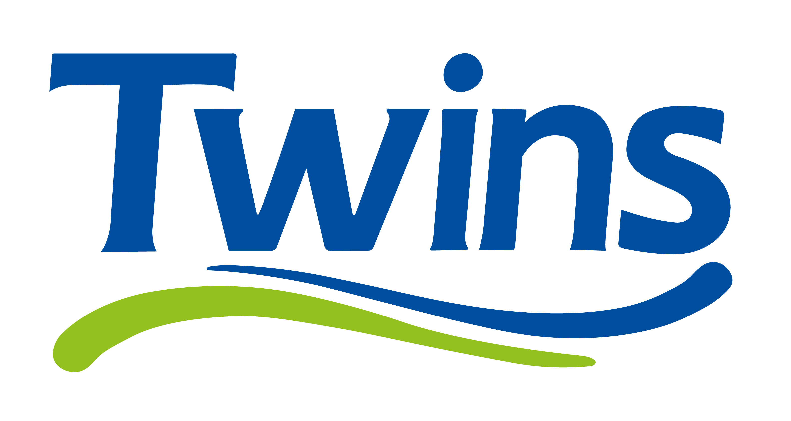

# 🚀 TWINS VANTAGE PRO — Fleet & Hardware Intelligence System



> **Centro de Diagnóstico, Hardware 3D y Monitoreo de Flota TI de Importadora Arcángel / Útiles Twins.**  
> Diseñado bajo arquitectura **Lenovo Vantage / Lenovo Legion Command Center**, con motor **3D WebGL interactivo en tiempo real (Three.js)**, aplicación **PWA instalable en celulares/tablets** y auditoría profunda de 26 computadoras del dominio `utilestwins.com`.

---

## ✨ Características Principales

### 1. 🖥️ Setup 3D Interactivo WebGL (Three.js)
- **Render 3D en Tiempo Real:** Chasis gamer/workstation con panel de vidrio templado, bomba de refrigeración líquida RGB, módulos RAM iluminados y tarjeta gráfica GeForce RTX con disipación activa.
- **Monitor Curvo Panorámico / 2K ProArt:** Pantalla 3D con textura dinámica interactiva que renderiza gráficos de radar de red, anillos de telemetría y estado de enlace con el Servidor Active Directory.
- **Periféricos & Entorno Cyber:** Teclado mecánico con iluminación underglow, mouse gaming y base de escritorio con halo de neón.
- **Controles 360° & Presets de Iluminación:** Rotación orbital con mouse/touch, zoom dinámico y cambio instantáneo de temas de color (*RGB Aurora*, *IT Cyan*, *Server Blue*, *Stealth Emerald*).

### 2. 📱 PWA (Progressive Web App) para Móviles & Tablets
- **100% Instalable:** Compatible con iOS (Safari) y Android (Chrome) como aplicación nativa independiente.
- **Navegación Táctil:** Barra de pestañas inferior optimizada para celulares y paneles deslizables con micro-interacciones.
- **Soporte Offline:** Service Worker con caché inteligente de activos y sincronización automática.

### 3. 📊 Dashboard de Telemetría Local en Vivo (`ARCNTID002 - tajho`)
- Medición en tiempo real de carga de CPU (Intel Core i5-12400 6C/12T @ 4.40GHz), uso de memoria RAM (32 GB) y estado SMART de unidad NVMe Gen4 C:.
- Optimizador de memoria y limpieza de caché con efectos de sonido Web Audio y lluvia de confeti.
- Selector de perfil de energía (*Rendimiento Extremo TI* vs *Equilibrado*).

### 4. 🗂️ Flota de 26 Computadoras de la Empresa
- Catálogo interactivo de todos los puestos de trabajo auditados en `utilestwins.com`:
  - **Marketing y Diseño (9):** Torres de alto rendimiento con RTX 4060 Ti / RTX 3060 / Ryzen 7 5700X y monitores ASUS ProArt 2K 1440p @ 74Hz.
  - **Administración (11):** Estaciones de trabajo Intel Core i5 12va Gen con NVMe Gen4 y paneles Samsung IPS.
  - **Ventas (3):** Terminales punto de venta comerciales.
  - **Almacén (1):** Estación de control logístico con 16GB Dual Channel y NVMe 1TB.
  - **Sistemas TI (1):** Estación de administración y jefatura TI.
  - **Servidores (1):** Servidor Central de Dominio (Intel Core i7-14700 20C/28T, 64GB RAM, Samsung 990 PRO + HDD WD Purple 8TB).
- Filtros por departamento, estado en línea/offline, detección de cuellos de botella y búsqueda instantánea.

### 5. 🩺 Centro de Diagnóstico & Detección de Errores
- **Detección de Single Channel RAM:** Alerta inteligente en las 10 PCs configuradas con 1 solo módulo de memoria (+18% a +25% de mejora disponible).
- **Alerta de Almacenamiento Crítico:** Detección de unidades con <15% de espacio libre (como `ARCNMRKD009` con 1 GB libre en C:).
- **Escáner Automatizado de Flota:** Verificación por pasos de Active Directory, latencia de red, salud SMART de discos y parches de Windows 11 Build 26200.

### 6. 📄 Impresión de Fichas Técnicas de Auditoría
- Generación de hojas de auditoría en PDF listas para impresión con especificaciones de placa madre, CPU, RAM, GPU, números de serie y usuario asignado.

---

## 🚀 Instalación y Ejecución Local

### Requisitos:
- **Node.js** (v18 o superior)
- Cualquier navegador moderno (Chrome, Edge, Firefox, Safari)

### Iniciar la Aplicación:
```bash
# 1. Clonar el repositorio
git clone https://github.com/tajho/twins-vantage.git

# 2. Ingresar a la carpeta
cd twins-vantage

# 3. Iniciar el servidor local
node server.js
```
O simplemente haz doble clic en **`INICIAR_TWINS_VANTAGE.bat`**.

Abre tu navegador en:  
👉 **http://localhost:3000**

---

## 🛠️ Stack Tecnológico
- **Frontend:** Vanilla JS (ES6+), HTML5, Tailwind CSS, Three.js WebGL, OrbitControls, Canvas Confetti, Web Audio API, Lucide Icons.
- **PWA:** Service Worker (Cache API), Web App Manifest.
- **Backend:** Node.js HTTP REST Server + WMI / PowerShell Live System Diagnostics Engine.
- **Estilo:** Dark Cyber-Stealth Glassmorphism (Lenovo Vantage / Legion UI).

---

*Desarrollado para Importadora Arcángel & Útiles Twins — 2026.*
